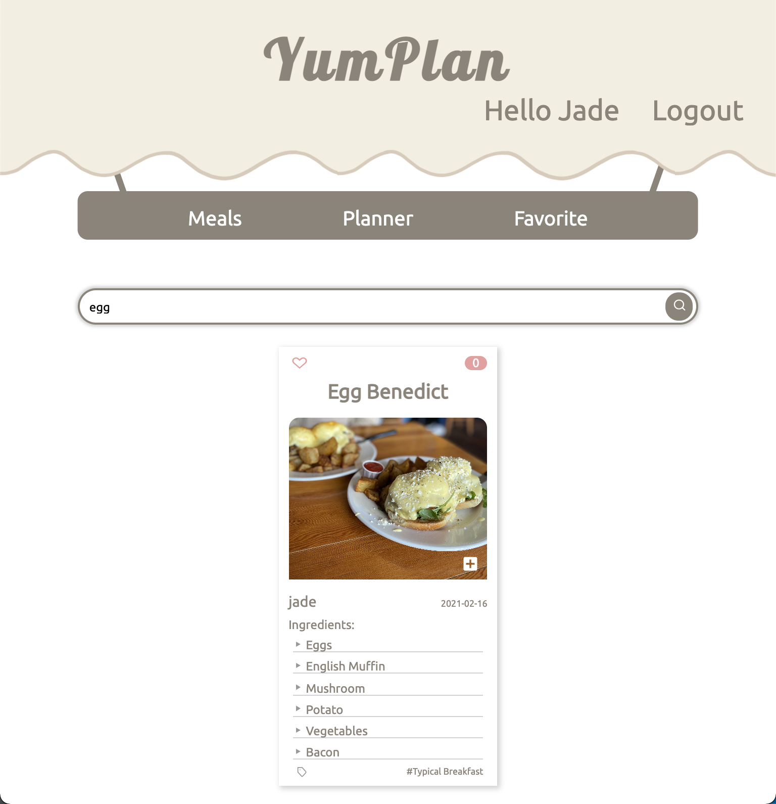

<h1 align="center">
YumPlan
</h1>

<p align="center">
   <a href="https://github.com/dbwjd5864/YumPlan/blob/master/LICENSE">
      
   </a>
</p>

### **Frontend** - React + Redux

### **Backend** - Node js, Express, MongoDB

<br>

> "**YumPlan**" is built with the MERN stack. It gives you the variety in your daily meal.<br>
> You can see what people eat, get ideas for your meal AND create your meal plan for the week or to share with other people.

Live Demo : <a href='https://yumplan.herokuapp.com'> Click here :) </a>

## Quick Start

1. Fork the repository and Clone it.

2. Add your .env file under server folder

```javascript
NODE_ENV = 'development';
DB_CONNECTION = 'your mongodb_url';
TOKEN_SECRET = 'anything your secret';
TOKEN_EXPIRES_IN = '90d (your choice)';
JWT_COOKIE_EXPIRES_IN = '90 (only number)';
```

3. Now run the app

```bash
# Install dependencies for server
cd server && npm install

# Install dependencies for client
cd server && npm run clientinstall

# Run the client & server with concurrently
cd server && npm run dev

# Run the Express server only
cd server && npm run server

# Run the React client only
cd server && npm run client

# Server runs on http://localhost:5000 and client on http://localhost:3000`
```

## Contents

Unauthorized users can visit **Home** and **Meals** page only

<p float='left' align='middle'>


<p align='middle'>Home || all Meals</p>
</p>

---

After signup or login, users can add create their own **_weekly planner_**, see what they have added to their **_meal planner_** and add other people's meals to their **_favorite_**

<p float='left' align='middle'>


<p align='middle'>weekly || my Meals</p>
</p>

<p float='left' align='middle'>


<br>
<p align='middle'>favorite || favorite-detail</p>
</p>

---

Users can **_search_** other people's meal ideas using keyword and give a **_like_** button

<p float='left' align='middle'>


<br>
<p align='middle'>Search || Like</p>
</p>

## Information

### Author

[Yujeong Choung](https://yumplan.herokuapp.com)

### Version

1.0.0

### License

[MIT License](https://github.com/dbwjd5864/YumPlan/blob/master/LICENSE)
